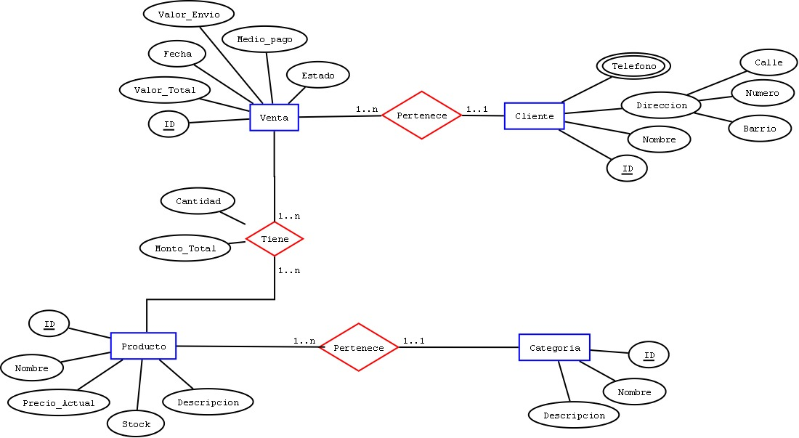

# TIENDA EN LÍNEA - FIS
## ROLES

Lindsey Katherine Camargo Beltrán - 20172020037
Brayan Esteban Leon Pinto - 20141001002
Jorge Alberto Galeano Vélez - 20172020060

* Cliente
* Tendero
* Domiciliario

## PROCESOS
### Venta de productos 
* Gestión del pago métodos de pago: crédito, débito, contra entrega (efectivo, crédito o débito)
* Gestión de devoluciones
* Identificacion del cliente
* Historico compras de cliente
* Historico ventas domiciliario

### Gestión de pedidos
* Validar atención de pedido (entrega)
* Gestión inventario (que exista)
* Comunicación con el cliente asociada al pedido
* Agendar entregas
* Visualizar pedidos

### Preparación de pedidos
* Retirar productos del inventario
* Confirmar pedidos
* Identificar entrega y dirección
* Generar facturacion

### Despacho de pedidos
* Buscar domiciliario disponible
* Confirmar domiciliario al cliente
* Visualizar ubicación de pedido
* Seleccionar la ruta óptima de entrega de pedidos

### Mercadeo de productos
* Identificar tendencias de compras
* Creación de promociones

### Gestión inventario
* Agregar o sacar productos del inventario
* Generar alertas sobre cantidades mínimas

## HISTORIAS DE USUARIO
### Cliente 
* Como cliente deseo solicitar a mi tendero productos desde mi computador para facilitar mis compras
* Como cliente deseo solicitar a mi tendero productos desde mi dispositivo para facilitar mis compras 
* Como cliente deseo programar la hora de entrega
* Como cliente deseo seleccionar productos y agregarlos a mi pedido de manera grafica para facilitar la compra
* Como cliente deseo poder seleccionar la lista de mis pedidos para poder cancelar un pedido
* Como cliente deseo cancelar parcialmente productos de mi pedido para facilitar los procesos de compra
* Como cliente deseo ingresar un motivo de cancelacion de un pedido para aclarar porque se cancela dicho pedido
* Como cliente deseo tener un recordatorio de los pedidos mas frecuentes para ayudarme a organizar mis compras
* Como cliente deseo tener un historial de mis compras para aclarar los gastos realizados en la tienda
* Como cliente deseo buscar promociones segun mis preferencias para obtener mejores beneficios
* Como cliente deseo que mi ubicacion se obtenga automaticamente para facilitar mi ubicacion

### Tendero
* Como tendero deseo una lista ordenada de pedidos recibidos para poder despachar sin perder pedidos 
* Como tendero deseo poder administrar la lista de pedidos recibidos para organizar el negocio
* Como tendero deseo que los productos ofertados esten enlazados en inventario para poder ofrecer productos en existencia
* Como tendero deseo tener control del inventario para saber que conseguir para hacer el inventario atractivo a compradores
* Como tendero deseo conocer por avisos los productos que están por terminarse en inventario para poder gestionarlos
* Como tendero deseo tener reportes sobre productos con mas solicitudes para gestion del inventario
* Como tendero deseo crear campaña promocional como difusion a clientes para mejorar el negocio
* Como tendero deseo que la orden del pedido lista genere factura para ser enviada con el domiciliario

### Domiciliario
* Como domiciliario deseo agrupar mis entregas para hacer eficiente mi trabajo

## Tareas primer ciclo (Como cliente deseo solicitar a mi tendero productos...)
* Desarrollar la estructura de la base de datos. Llenar con 15-20 productos con su caracterización completa.

[Script creación base de datos](https://github.com/jagaleanov/tienda/blob/main/01_BD.sql)

[Script llenado base de datos](https://github.com/jagaleanov/tienda/blob/main/02_script_llenado.sql)

* Generar el servicio que permita consultar la base de datos y retornar un json con la descripción del producto y demás datos para montar en la página principal.

[Script consultas de productos](https://github.com/jagaleanov/tienda/blob/main/03_db_consummer.php)

## Tareas segundo ciclo
* Seleccionar en un cliente temporal el producto para que al finalizar el registro de una compra se registre el pedido completo asociado a un cliente. (Armar carrito en $session)